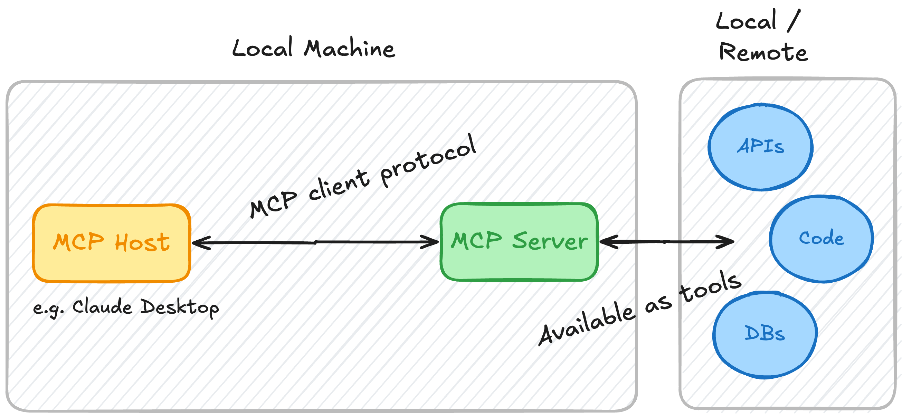
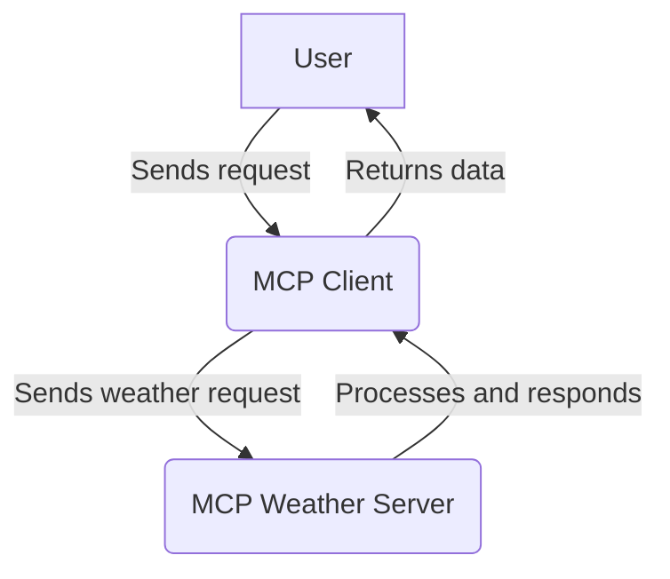
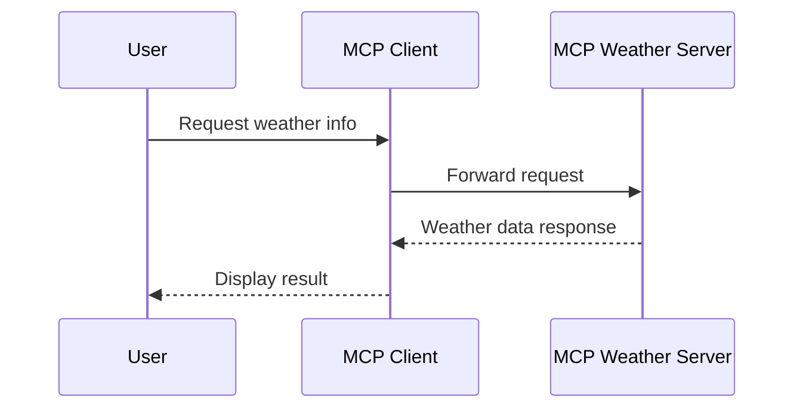

# MCP Server Example

This repository contains an implementation of a Model Context Protocol (MCP) server for educational purposes. This code demonstrates how to build a functional MCP server that can integrate with various LLM clients.

## What is MCP?

MCP (Model Context Protocol) is an open protocol that standardizes how applications provide context to LLMs. Think of MCP like a USB-C port for AI applications - it provides a standardized way to connect AI models to different data sources and tools.



### Key Benefits

- A growing list of pre-built integrations that your LLM can directly plug into
- Flexibility to switch between LLM providers and vendors
- Best practices for securing your data within your infrastructure

## Architecture Overview

MCP follows a client-server architecture where a host application can connect to multiple servers:

- **MCP Hosts**: Programs like Claude Desktop, IDEs, or AI tools that want to access data through MCP
- **MCP Clients**: Protocol clients that maintain 1:1 connections with servers
- **MCP Servers**: Lightweight programs that expose specific capabilities through the standardized Model Context Protocol
- **Data Sources**: Both local (files, databases) and remote services (APIs) that MCP servers can access

## Core MCP Concepts

MCP servers can provide three main types of capabilities:

- **Resources**: File-like data that can be read by clients (like API responses or file contents)
- **Tools**: Functions that can be called by the LLM (with user approval)
- **Prompts**: Pre-written templates that help users accomplish specific tasks

# MCP Project Overview

This project contains two main components: a client and a weather server, both implemented in Python. Below is a high-level flow and structure of the project, including diagrams for clarity.

## Project Structure

```
test/
├── mcp-client-example/
│   └── mcp-client/
│       ├── .env
│       ├── .python-version
│       ├── client.py
│       ├── pyproject.toml
│       ├── README.md
│       └── uv.lock
└── mcp-weather-server-example/
    └── weather/
        ├── .python-version
        ├── pyproject.toml
        ├── README.md
        ├── uv.lock
        └── weather.py
```

## System Flow Diagram



## Component Details

### MCP Client
- Reads user input or requests
- Forwards requests to the MCP Weather Server
- Receives and processes responses

### MCP Weather Server
- Receives requests from the client
- Processes weather data (mock or real)
- Sends responses back to the client

## Sequence Diagram



---

Feel free to expand this README with setup instructions, API details, or usage examples as needed.