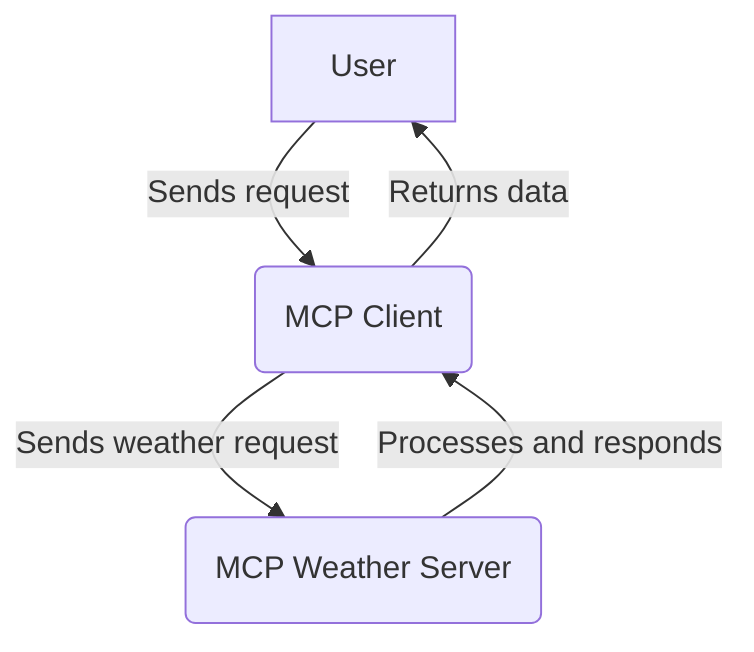
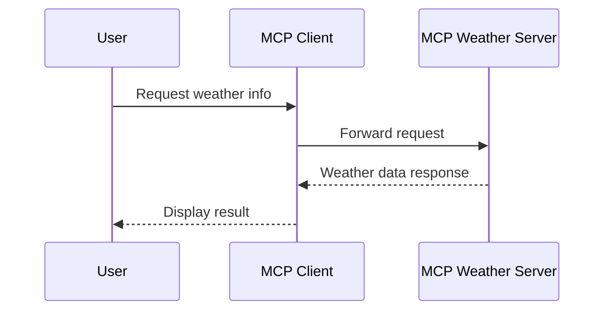

# MCP Project Overview

This project contains two main components: a client and a weather server, both implemented in Python. Below is a high-level flow and structure of the project, including diagrams for clarity.

## Project Structure

```
test/
├── mcp-client-example/
│   └── mcp-client/
│       ├── .env
│       ├── .python-version
│       ├── client.py
│       ├── pyproject.toml
│       ├── README.md
│       └── uv.lock
└── mcp-weather-server-example/
    └── weather/
        ├── .python-version
        ├── pyproject.toml
        ├── README.md
        ├── uv.lock
        └── weather.py
```

## System Flow Diagram



## Component Details

### MCP Client
- Reads user input or requests
- Forwards requests to the MCP Weather Server
- Receives and processes responses

### MCP Weather Server
- Receives requests from the client
- Processes weather data (mock or real)
- Sends responses back to the client

## Sequence Diagram



---

Feel free to expand this README with setup instructions, API details, or usage examples as needed.